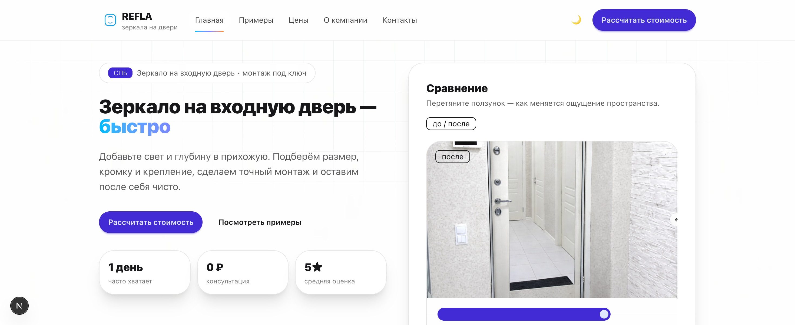

# REFLA — сайт услуг по установке зеркал на входные двери



Live website: https://refla.ru

Коммерческий сайт для компании, занимающейся установкой зеркал на входные двери.  
Проект разработан мной и используется в продакшене.

---

## О проекте

Сайт предназначен для приёма заявок от клиентов и расчёта стоимости услуг.  
Основная цель — упростить получение лидов и автоматизировать обработку заявок.

Реализованы интерактивные элементы, формы и интеграции для уведомлений.

---

## Основной функционал

- Калькулятор стоимости услуг
- Формы заявок с валидацией
- Отправка заявок на сервер
- Уведомления о новых заявках через Telegram
- Статическая генерация страниц (SSG)
- Деплой на Vercel, настройка домена и HTTPS

---

## Стек

- Next.js
- TypeScript
- React
- CSS
- Telegram Bot API
- Vercel

---

## Страницы

- О нас  
- Примеры работ  
- Прайс-лист  
- Контакты  
- Оставить заявку  

---

## Интеграция формы заявок

Форма отправляет данные на сервер через PHP-скрипт.

**Endpoint:**
```

POST /lead.php

````

**Request (JSON):**
```json
{
  "name": "string",
  "contact": "string",
  "address": "string",
  "comment": "string"
}
````

**Response (JSON):**

```json
{
  "ok": true
}
```

---

## Запуск проекта локально

1. Установка зависимостей:

```bash
npm install
```

2. Запуск в режиме разработки:

```bash
npm run dev
```

3. Сборка и экспорт статического сайта:

```bash
npm run build && npm run export
```

После сборки статический сайт находится в папке `out/`.

---

## Хостинг без Node.js

Проект может быть размещён на любом хостинге без Node.js:

* Загрузить содержимое папки `out/`
* Файл `lead.php` размещается на сервере
* Формы отправляют JSON на `/lead.php`

---

## Статус проекта

Сайт находится в продакшене и используется реальными пользователями:
* [https://refla.ru](https://refla.ru)
* [Vercel deploy](https://refla-mirror-site.vercel.app?_vercel_share=15FiAlqfZaIuG62zsqLWniQHITxdhNG6)

---

## Роль разработчика

В рамках проекта я:

* Разработал клиентскую часть сайта
* Реализовал калькулятор стоимости
* Настроил и реализовал формы заявок
* Интегрировал уведомления через Telegram Bot API
* Настроил деплой, домен и HTTPS
* Поддерживаю и дорабатываю проект